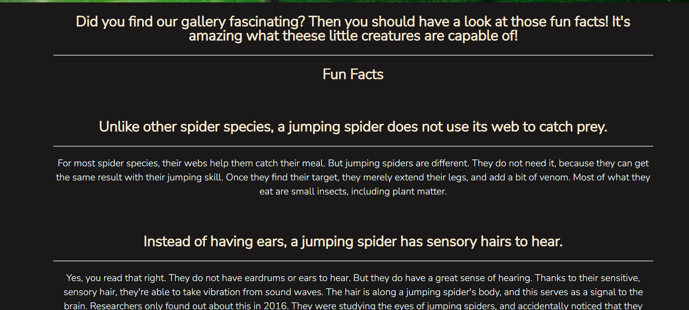
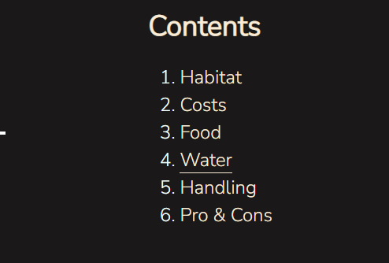
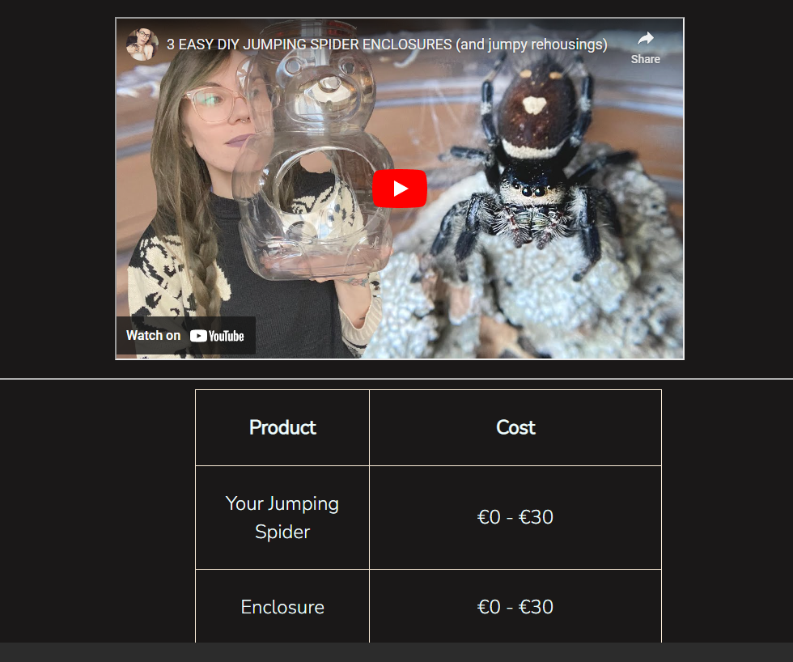
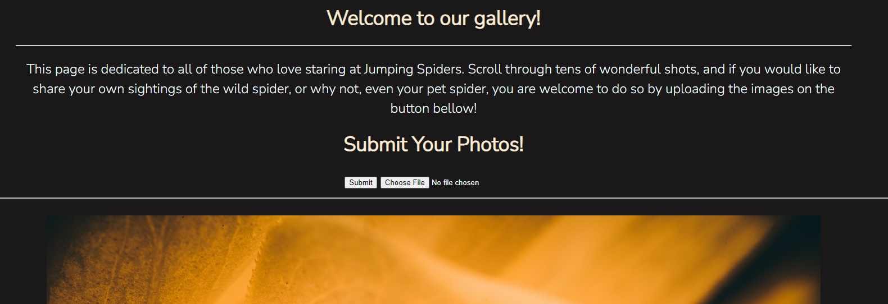

# Jumping Spider Club

This is a website for spider lovers. Users can come here to learn about the jumping spider, view or submit their own pictures or subscribe to the newsletter.

## Features 

### Existing Features

- __Navigation Bar__

  - Featured on all pages, the full responsive navigation bar includes links to the pages and is identical in each page to allow for easy navigation.
  - This section will allow the user to easily navigate from page to page across all devices without having to revert back to the previous page via the ‘back’ button. 

- __Fun Facts__

  -  
  - 

- __Pet Care__
   
  - Content table for easier navigation across the Pet Care section, making easier to find the desired informations.
  - I provided a video from youtube with even more information about how the perfect enclosure should be, in order for your spider to feel happy.
  - A table shows the approximate costs of owning a jumping spider.

- __The Footer__ 

  - The footer section includes links to the relevant social media sites for Love Running. The links will open to a new tab to allow easy navigation for the user. 
  - The footer is valuable to the user as it encourages them to keep connected via social media

- __Sightings__

  - Sightings page is all about pictures. User can admire the photos or even become part of the wall of fame, by submitting their own shots. 
  - Submissions can be done by hitting the "submit" button after browsing for the files.

- __The Sign Up Page__

  - This page will allow the user to get signed up to Love Running to start their running journey with the community. The user will be able specify if they would like to take part in road, trail or both types of running. The user will be asked to submit their full name and email address. 

### Features Left to Implement

- A forum

## Testing 

- Tested the website on my mobile phone & from 2 different browsers (Google Chrome and Bing)

### Validator Testing 

- HTML
  - No errors were returned when passing through the official [W3C validator](https://validator.w3.org/nu/?doc=https%3A%2F%2Fdeian13.github.io%2FJumping-Spider-Journal%2F)
- CSS
  - No errors were found when passing through the official [(Jigsaw) validator](http://jigsaw.w3.org/css-validator/validator?lang=en&profile=css3svg&uri=https%3A%2F%2Fdeian13.github.io%2FJumping-Spider-Journal%2F&usermedium=all&vextwarning=&warning=1)

## Deployment

- The site was deployed to GitHub pages. The steps to deploy are as follows: 
  - In the GitHub repository, navigate to the Settings tab 
  - From the source section drop-down menu, select the Master Branch
  - Once the master branch has been selected, the page will be automatically refreshed with a detailed ribbon display to indicate the successful deployment. 

The live link can be found here - https://deian13.github.io/Jumping-Spider-Journal/ 

## Credits 

### Content 

- https://www.healthline.com/health/jumping-spider-bite  -> the source to infos on jumping spider bites from index.html

- https://www.treehugger.com/jumping-spider-facts-4864103  --> fun facts

- https://www.wikihow.com/Catch-and-Care-for-a-Jumping-Spider

- https://facts.net/jumping-spider-facts/  -> the source for the infos provided on the Fun Fact page of my project.

- https://spoodernest.com/what-to-feed-your-jumping-spider-tips/  --> the source for the infos on how to feed and take care of a spider, provided on the pet-care.

- https://short-fact.com/how-often-do-jumping-spiders-drink-water/  --> source for spiders and drinks on page pet-care

- https://spoodernest.com/handling-jumping-spider/     --> How to handle a jumping spider from pet-care page

- https://coolpetsadvice.com/pet-jumping-spiders-guide/ --> Pros & Cons from pet-care page, costs

- https://xtraordinarypets.com/jumping-spiders-beginners-care-guide/

- The icons in the footer were taken from [Font Awesome](https://fontawesome.com/)

### Media

-
- 

